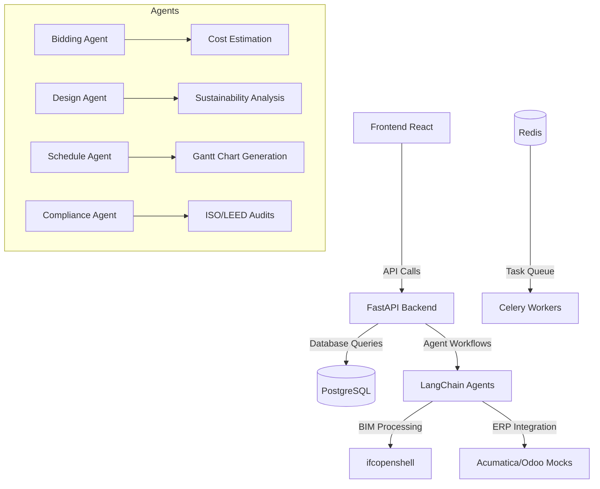

# AEC Orchestrator

**Full-stack AI-powered construction project management and orchestration platform**


## Overview

AEC Orchestrator is a comprehensive solution for managing Architecture, Engineering, and Construction (AEC) projects using advanced AI agents. The platform integrates LangChain-based workflows with BIM data processing, ERP systems, and sustainability analytics.

### Key Features
- **Multi-agent orchestration** using LangGraph state machines
- **BIM file processing** with IFC/Revit integration via ifcopenshell
- **ERP system integration** (Acumatica/Odoo mocks)
- **Sustainability analysis** and LEED certification support
- **Real-time project monitoring** with sensor data analytics

## Project Structure

```
aec-orchestrator/
├── backend/          # FastAPI backend services
│   ├── src/
│   │   ├── backend/  # Main API endpoints
│   │   └── agents/   # LangChain agent implementations
│   └── tests/        # Backend test suite
├── frontend/         # React TypeScript UI
│   ├── public/       # Static assets
│   └── src/          # Frontend components/pages
├── db/               # Database migrations (Alembic)
├── agents/           # Agent definitions and workflows
├── docs/             # API documentation & user guides
├── infra/            # Infrastructure as code
│   └── docker-compose.yml  # Local development stack
└── demo/             # Sample data for testing
```

## Setup Instructions

### Prerequisites
- Docker (for local development)
- Python 3.12+ with Poetry
- Node.js 20+ with npm/yarn

### Backend Setup

```bash
# Install backend dependencies
cd backend
poetry install

# Set up environment variables
cp .env.example .env
vim .env  # Edit database and API keys

# Apply database migrations
alembic upgrade head
```

### Frontend Setup

```bash
cd frontend
npm install
```

### Running Locally with Docker Compose

```bash
docker-compose up --build
```

## Usage Examples

### Trigger Agent Workflow

```bash
curl -X POST "http://localhost:8000/api/agents/run" \
  -H "Content-Type: application/json" \
  -d '{
    "agent_type": "bidding",
    "input_data": {
      "rfp_path": "/path/to/rfp.txt"
    }
  }'
```

### View API Documentation

Open [http://localhost:8000/docs](http://localhost:8000/docs) in your browser to access the Swagger UI.

## Architecture Diagram



## Contributing

Please see [CONTRIBUTING.md](docs/CONTRIBUTING.md) for development guidelines and best practices.

## Security & GDPR Compliance

This project follows strict data protection principles:
- All sensitive data is encrypted in transit (TLS)
- User authentication uses JWT with bcrypt password hashing
- Data retention policies are documented in [GDPR.md](docs/GDPR.md)

## Deployment Options

### Frontend
Recommended: Deploy to Vercel for serverless React hosting.

### Backend
Options:
- Render.com (fully managed PostgreSQL add-on)
- Fly.io (global edge deployment with Postgres support)
- AWS ECS/Fargate with RDS

## License

This project is licensed under the MIT License. See [LICENSE](LICENSE) for details.


# Initial commit
