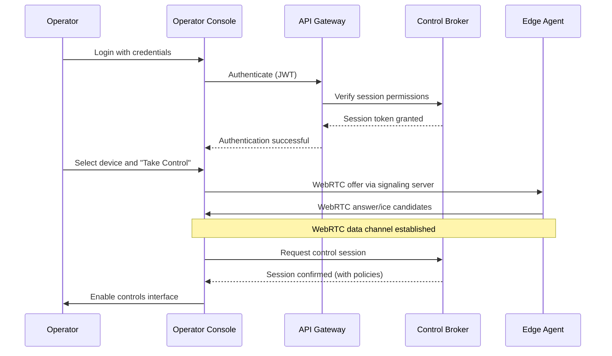
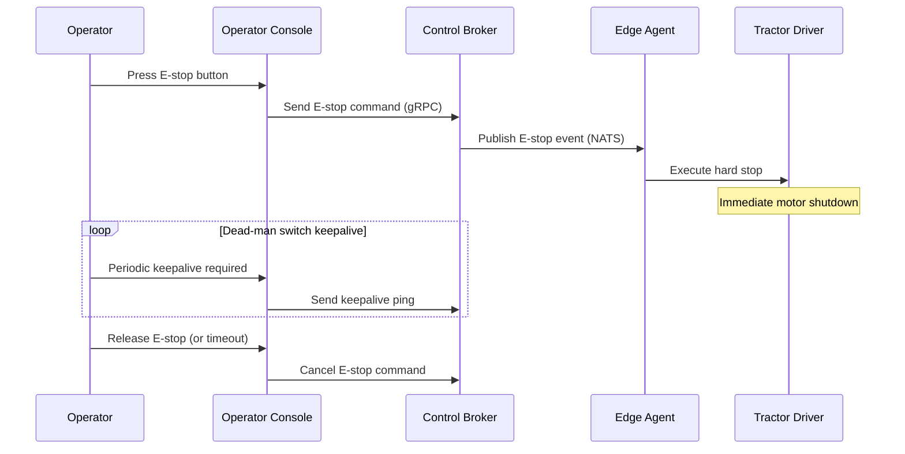

# Rover Operations Architecture

## System Overview
Rover Operations is a tele-operation and supervised autonomy platform designed for heavy machines. The system consists of several key components:

1. **Operator Console**: Web-based interface for operators to control vehicles
2. **Control Plane**: Cloud services that manage sessions, policies, and routing
3. **Edge Agent**: On-device software that connects to the cloud and manages local operations
4. **Device Drivers**: Implement device-specific capabilities (simulated for MVP)
5. **Storage Services**: Persistent storage for metadata, telemetry, and recordings

## Context Diagram

```mermaid
graph TD
    A[Operator] -->|WebRTC Video/Control| B[Operator Console]
    B -->|gRPC API| C[API Gateway]
    C -->|gRPC| D[Control Broker]
    C -->|gRPC| E[Policy Engine]
    C -->|gRPC| F[Telemetry Service]

    D -->|NATS Messaging| G[Edge Agent]
    G -->|WebRTC Data Channel| H[Tractor Device (Simulated)]
    G -->|gRPC Commands| H
    G -->|Telemetry Stream| I[ClickHouse Database]

    J[MinIO Object Storage] <--|Session Recordings| F

    classDef cloud fill:#f0f8ff,stroke:#444,stroke-width:2px;
    class C,D,E,F,G,J cloud;

    style A fill:#e6ffe6,stroke:#444,stroke-width:2px;
    style B fill:#fff5ee,stroke:#444,stroke-width:2px;
    style H fill:#ffebcc,stroke:#444,stroke-width:2px;
```

## Component Diagram

```mermaid
graph TD
    subgraph Cloud Services [Cloud Services]
        direction TB
        api[API Gateway] -->|gRPC| control[Control Broker]
        api -->|gRPC| policy[Policy Engine]
        api -->|gRPC| telemetry[Telemetry Service]

        control -->|NATS| signaling[Signaling Server]
        control -->|E-stop Events| policy
    end

    subgraph Edge [Edge Device]
        direction TB
        agent[Edge Agent] -->|WebRTC Data| driver[Hello Tractor Driver]
        agent -->|gRPC Commands| driver
        agent -->|Telemetry Stream| telemetry
    end

    subgraph Storage [Storage Services]
        direction TB
        postgres[Postgres Metadata] <--|Device State| control
        postgres <--|Policies| policy
        clickhouse[ClickHouse Telemetry] <--|Time-series Data| telemetry
        minio[MinIO Recordings] <--|Session Replays| replay_service[Replay Service]
    end

    operator_console[Operator Console] -->|WebRTC Video/Control| agent
    operator_console -->|gRPC API| api
```

## Sequence Diagram: "Take Control"



## Sequence Diagram: "E-stop Activation"



## Data Flow Diagram

```mermaid
graph TD
    subgraph Cloud [Cloud Services]
        direction TB
        A[API Gateway] -->|gRPC| B[Control Broker]
        A -->|gRTC| C[Policy Engine]

        B -->|NATS Events| D[Edge Agent]
        C -->|Policy Updates| D

        E[Telemetry Service] <--|Time-series Data| F[ClickHouse Database]
    end

    subgraph Edge [Edge Device]
        direction TB
        G[Hello Tractor Driver] -->|Command Responses| H[Edge Agent]
        H -->|Telemetry Stream| E
        H -->|Video Frames| I[WebRTC PeerConnection]
    end

    J[Operator Console] -->|Control Commands| A
    J <--|Video Stream| I
```

## Safety Architecture

The safety architecture is designed with multiple layers of protection:

1. **Virtual E-stop**: Enforced at both edge agent (hard stop) and control broker levels
2. **Dead-man Switch**: Operator must send periodic keepalive signals to maintain control
3. **Geofencing**: Policy engine blocks commands that would violate geofence boundaries
4. **Speed Caps**: Maximum speed limits enforced by policy engine with tamper-evident logging

## Network Architecture

```mermaid
graph TD
    subgraph Operator [Operator Location]
        UI[Operator Console] -->|HTTPS| Gateway[API Gateway]
        UI <--|WebRTC Video| EdgeAgent[Edge Agent]
    end

    subgraph Cloud [Cloud Infrastructure]
        direction TB
        Gateway -->|gRPC| ControlBroker[Control Broker]
        Gateway -->|gRPC| PolicyEngine[Policy Engine]

        ControlBroker -->|NATS| SignalingServer[Signaling Server]
        TelemetryService[Telemetry Service] -->|HTTP| ClickHouse[ClickHouse Database]

        ReplayService[Replay Service] -->|API| MinIO[MinIO Object Storage]
    end

    subgraph Edge [Edge Device Location]
        direction TB
        EdgeAgent -->|WebRTC Data Channel| TractorDriver[Tractor Driver]
        EdgeAgent -->|gRPC Commands| TractorDriver
        EdgeAgent -->|Telemetry Stream| TelemetryService
    end

    style UI fill:#fff5ee,stroke:#444;
    style EdgeAgent fill:#ffebcc,stroke:#444;
    style TractorDriver fill:#ffebcc,stroke:#444;

    class Cloud fill:#f0f8ff,stroke:#444,stroke-width:2px;
```

