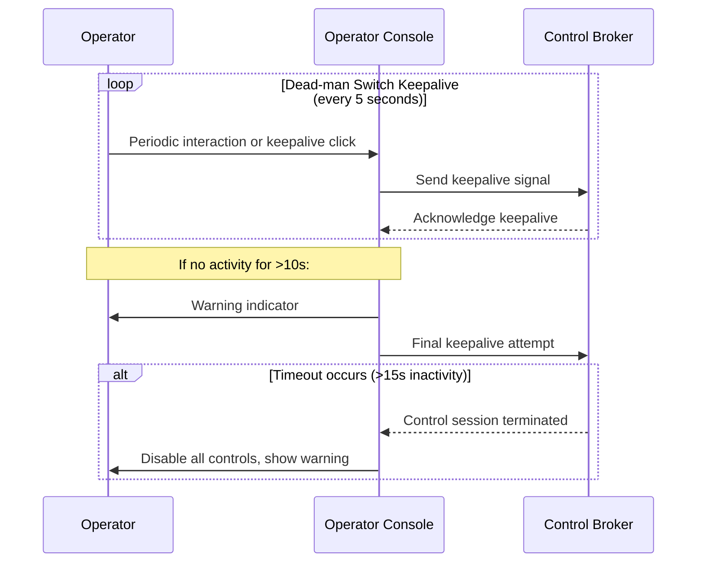

# Rover Operations Safety Documentation

## Safety Case Overview
Rover Operations is designed with safety as a primary concern. The system implements multiple layers of protection to ensure operator and equipment safety during tele-operation activities.

### Key Safety Features:
1. **Virtual E-stop System**
2. **Dead-man Switch Mechanism**
3. **Geofencing Enforcement**
4. **Speed Cap Limits**
5. **Role-Based Access Control (RBAC)**

## 1. Virtual E-stop System

The virtual E-stop system provides immediate emergency stopping capability:

- **Hard Stop at Edge**: The edge agent enforces physical motor shutdown when an E-stop command is received
- **Broker Mirroring**: The control broker maintains state and ensures consistent E-stop propagation
- **UI Feedback**: Operator console provides visual confirmation of E-stop activation

### E-stop Activation Flow:
1. Operator presses the E-stop button in the UI
2. Command sent to control broker via gRPC API
3. Broker publishes E-stop event to NATS messaging system
4. Edge agent receives event and executes hard stop on connected device
5. Visual confirmation displayed in operator console

## 2. Dead-man Switch Mechanism

The dead-man switch requires operators to send periodic keepalive signals to maintain control:

- **Keepalive Interval**: Operator must send a keepalive signal every X seconds (configurable)
- **Timeout Enforcement**: If no keepalive received within timeout period, all controls are disabled
- **Automatic Release**: Control session is automatically terminated if dead-man switch fails

### Implementation Details:

## 3. Geofencing Enforcement

Geofences define restricted areas where vehicle operation is prohibited:

- **Polygon Definitions**: Geofences are defined as polygons with latitude/longitude coordinates
- **Command Blocking**: Policy engine validates commands against geofence boundaries before execution
- **UI Overlay**: Operator console displays geofence zones on map interface

### Geofencing Algorithm:
1. Command received from operator (move forward, turn, etc.)
2. Policy engine calculates projected vehicle position after command execution
3. If projected position intersects with any geofenced area → command rejected
4. Rejection notification sent to operator console

## 4. Speed Cap Limits

Speed caps prevent vehicles from exceeding safe operating speeds:

- **Configurable Limits**: Maximum speed defined per device or role
- **Policy Enforcement**: Policy engine validates all speed commands against limits
- **Tamper-evident Logging**: All speed-related commands and violations are logged with timestamps

## 5. Role-Based Access Control (RBAC)

Access control ensures operators only have permissions appropriate to their roles:

- **Operator Roles**: Admin, Supervisor, Operator, Trainer
- **Permission Levels**: Different command sets available per role
- **Session Auditing**: All control sessions are logged with operator identity

## Safety Testing and Validation

### Unit Tests:
- E-stop activation/deactivation sequences
- Geofence boundary calculations
- Speed cap enforcement logic
- Dead-man switch timeout handling

### Integration Tests:
- End-to-end E-stop flow from UI to device shutdown
- Geofence violation scenarios with command blocking
- Dead-man switch failure modes and recovery

## Safety Documentation Requirements

All safety-critical components must have:

1. **Design Specifications**: Detailed architectural diagrams
2. **Safety Validation Plans**: Test cases for each safety feature
3. **Operational Procedures**: Standard operating procedures (SOPs) for emergency scenarios
4. **Training Materials**: Operator training on safety features and emergency protocols

## Emergency Procedures

### E-stop Activation Procedure:
1. Press the red E-stop button in the operator console
2. Verify visual confirmation of E-stop activation
3. Monitor vehicle status until it comes to a complete stop
4. Follow post-E-stop procedures for vehicle recovery

### Dead-man Switch Failure Procedure:
1. If dead-man switch warning appears, immediately click "Keep Alive" button
2. If controls become disabled due to timeout, notify supervisor
3. Follow established protocols for regaining control of the vehicle

## Compliance and Certification

The safety architecture is designed to comply with relevant industry standards including:

- ISO 10218 (Industrial robots - Safety)
- ISO 15066 (Robots and robotic devices - Collaborative robots)
- ANSI/RIA R15.06 (American National Standard for Industrial Robots)

